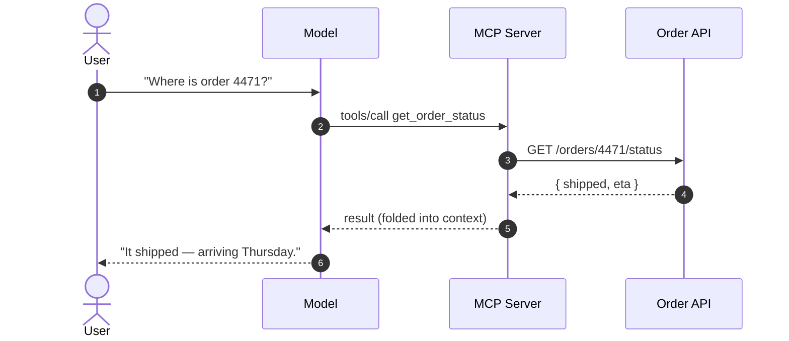

<!-- ============================================================
     COVER — Archetype A
     ============================================================ -->

<Hero bg="cover.jpg" kicker="GenAI · a team refresher">
  The GenAI refresher you didn't ask for
  <template #subtitle>
    …but might enjoy anyway. A 45-minute tour — from the history of AI
    to autonomous agents — built up one idea at a time.
  </template>
</Hero>

<!--
Welcome. One promise for the next 45 minutes: by the end, this "AI revolution" should feel
less like magic and more like a system you could have designed.

Through-line: three words — Compute, Reason, Act. Machines that calculate, then reason,
then act. The big question on screen is the hook; I'll return to it at the very end.
-->

---
layout: default
---

<!-- AGENDA — zoom-in: GenAI is one small box inside AI.
     Fixed canvas; starts empty; nested boxes + agenda reveal by opacity only. -->

  

    
Where we're going

    <h2>GenAI is one small box inside AI</h2>
  

  

    

      
Artificial Intelligence

      
rules · search · planning · robotics · vision …

    

    

      
Machine Learning

    

    

      
Generative AI

      
LLMs · agents

    

  

  

    

      
01

      
A brief history of AI

      
…and where GenAI fits

    

    

      
02

      
Reason

      
how an LLM actually works

    

    

      
03

      
Act

      
tools, MCP &amp; agents

    

  

<!--
Here's the shape of the next 45 minutes — and the first myth to kill.
[click] Everyone says "AI". AI is huge: seventy years of rules, search, planning, robotics, vision.
[click] Machine learning is one slice of that — systems that learn from data instead of hand-written rules.
[click] And generative AI — the LLMs and agents this whole talk is about — is a small box inside THAT.
When people say "AI" today, they almost always mean this little terracotta box.
[click] So: three moves. One — a brief history, to place that box. Two — zoom into Reason: how an LLM
actually works. Three — zoom into Act: tools, MCP, agents. Most of our time is in two and three.
-->

<!-- ============================================================
     HUMILITY — beginner's mind (Ygritte: "You know nothing, Jon Snow")
     ============================================================ -->

---
layout: default
---

<Hero bg="humility.jpg" kicker="A quick dose of humility" align="center" size="sm">
  The more we know, the less we know.
  <template #subtitle>
    Every answer here opens three new questions. That's not a gap to close — it's the job.
    Hold your certainty loosely, and keep a beginner's mind.
  </template>
</Hero>

<!--
A quick reset before we dive in. (Background — yes, that's Ygritte: "You know nothing, Jon Snow.")
It's easy to feel like we already know AI — we use it every day now. But this field rewrites itself
every few months, and the honest posture is humility. The more you learn here, the more you see how
much is still open. That's not discouraging — it's the fun part. Stay curious, stay a beginner.
-->

<!-- ============================================================
     PART I — From Computing to Reasoning
     ============================================================ -->

---
layout: default
---

<Hero bg="part-1.jpg" kicker="Part I · From computing to reasoning">
  Seventy years in one breath.
</Hero>

<!--
Quick history — not for trivia, but so we can see the one shift that changed everything.
We go from machines we program with rules, to machines that learn, to machines that predict.
-->

---
layout: default
clicks: 5
---

<!-- TIMELINE — build-up on fixed axis. clicks:5 drives the 5 reveals
     that live inside <Timeline/> (it reads $clicks). -->

  

    
A very short history of AI

    <h2>From hand-written rules → to learning → to prediction at scale</h2>
  

  <Timeline />

<!--
[click] Start in the 50s: rules and logic — we hand-write every if/then. Brittle.
[click] 90s: machine learning — stop writing rules, learn patterns from data.
[click] 2012: deep learning — neural nets crack vision and speech.
[click] 2017: the hinge. The Transformer — "attention is all you need". Architecture behind every modern LLM.
[click] 2022: the ChatGPT moment. Nothing new in principle — but scale made it feel like a step change.
The pattern: we stopped telling machines the rules, and started letting them predict.
-->

---
layout: default
---

<!-- WHAT CHANGED — statement-ish, fixed stage -->

  

    Prediction at scale started to look like reasoning.
  

  

    Train one model to predict the next word over the whole internet,
    and "predict the next word" quietly becomes "answer the question."
  

<!--
[click] Here's the whole magic trick in one line. Prediction at scale starts to look like reasoning.
[click] Train a model to predict the next word across the entire internet, and to get good at that
it has to absorb grammar, facts, style, even reasoning patterns. "Predict the next word" becomes
"answer the question." Which is exactly what we'll look at next.
-->

<!-- ============================================================
     PART II — Inside the reasoning machine
     ============================================================ -->

---
layout: default
---

<Hero bg="part-2.jpg" kicker="Part II · Inside the reasoning machine" size="sm">
  It predicts the next word. That's it.
</Hero>

<!--
Let's open the box. The thing everyone calls intelligence is, mechanically, a next-word predictor.
Watch.
-->

---
layout: default
clicks: 5
---

<!-- NEXT-TOKEN PREDICTOR -->

  

    
How an LLM generates text

    <h2>One token at a time — pick, append, repeat</h2>
  

  <NextTokenPredictor />

<!--
Prompt: "The smartest company Salesforce ever acquired is…". The context tokens flow left into the
network; billions of weights light up; out the right comes a probability over every possible next
token. (Wink at the room — MuleSoft wins; Slack and Informatica tie just behind.)
[click] "MuleSoft" wins at 44%. Commit it; the winning path lights up.
[click] Feed the whole sentence back in and predict again — a comma.
[click] Again: "obviously".
[click] Again: a full stop. The sentence is done.
[click] That's the entire engine: context in, predict the next token, append, feed it back, repeat.
Everything that feels like intelligence is this loop, run fast, at enormous scale.
-->

---
layout: default
clicks: 6
---

<!-- CONTEXT WINDOW -->

  

    
What the model can see

    <h2>The context window — a fixed amount of attention</h2>
  

  <ContextWindow />

<!--
If it just predicts the next token from what it's seen — how much can it see? A fixed-size window.
[click] First message — a little fills up.
[click] [click] The conversation grows; the window fills.
[click] Getting full — notice the colour shift. We're near capacity.
[click] [click] Over the limit. The window can't grow, so the OLDEST tokens fall out of view.
The model literally stops being able to see the start of the conversation. That "forgetting"
isn't a bug — it's the window. Bigger windows help, but the limit never disappears.
-->

---
layout: default
---

<Hero bg="part-2b.jpg" kicker="The most important slide" size="sm">
  And between two calls, it remembers nothing.
</Hero>

<!--
One more property, and it's the big one. The window explains what it sees in a single call.
But across calls? Nothing carries over. Let me show you exactly what the API receives.
-->

---
layout: default
clicks: 3
---

<!-- STATELESS REPLAY (hero interactive) -->

  

    
The stateless truth

    <h2>Every turn, you resend the entire conversation</h2>
  

  <StatelessReplay />

<!--
Left: what the human sees. Right: what the model actually receives on the API call.
Turn one: a question, a payload. Looks like a session.
[click] Turn two — watch the right panel. It didn't "remember" turn one; we resent it. The whole
thing — Q1, A1, and Q2 — in one payload.
[click] Turn three: same again. Re-sent top to bottom, every call. Watch the token counter climb —
you pay for the whole history each turn.
[click] Mental model for this room: no session on the server. The client carries all state in the
request body, every call. You've built against stateless endpoints for years — same shape.
-->

---
layout: default
---

<!-- PAYOFF — statement -->

  

    
It has no memory. Every call starts from zero.

    
Memory, history, "context" — that's <em>your</em> job, not the model's.

  

<!--
Let it land. The model is a pure function: text in, text out. No hidden state carried over.
Everything we build from here exists to feed the right things into that payload. This is the key
to the entire back half of the talk.
-->

<!-- ============================================================
     PART III — Giving it hands (tools / MCP)
     ============================================================ -->

---
layout: default
---

<Hero bg="part-3.jpg" kicker="Part III · Giving it hands">
  A mind with no hands.
</Hero>

<!--
So we have a brilliant reasoner that sees a window of text and forgets everything between calls.
Notice what it still can't do: anything. It can't read your database, check an order, send an email.
It only emits text. To be useful, it needs hands.
-->

---
layout: default
---

<!-- TOOLS — build-up on fixed stage -->

  

    
The idea behind tools

    <h2>Let the model ask — your code does the work</h2>
  

  

    

      
1 · Model asks

      
"call get_order_status(4471)"

    

    
→

    

      
2 · Your code runs

      
hits the real Order API

    

    
→

    

      
3 · Result goes back

      
folded into the next payload

    

  

  

    The model never touches your systems. It only <strong>requests</strong>; you stay in control of execution.
  

<!--
The mechanism is simple and it puts you in control.
[click] You hand the model a menu of tools it's allowed to ask for.
[click] It doesn't run anything — it emits a request: "please call get_order_status with 4471".
[click] YOUR code receives that, calls the real API — with your auth, your governance.
[click] The result is fed back into the model's next payload, and now it can answer.
[click] Key point for this audience: the model never touches your systems directly. It requests;
you execute. That's a security and governance story, not just a feature.
-->

---
layout: default
clicks: 3
---

<!-- MCP ENVELOPE -->

  

    
What MCP actually is

    <h2>An API with a standard envelope</h2>
  

  <McpEnvelope />
  

    MCP just standardises how a model discovers and calls tools — so any model talks to any tool,
    without a custom integration each time.
  

<!--
MCP — Model Context Protocol — sounds like a new world. It isn't.
On the left, an HTTP call you've shipped a thousand times. On the right, the same intent as an
MCP tool call.
[click] Look at the MCP side: a method, a tool name, JSON arguments, a JSON result.
[click] They line up one-to-one. Endpoint ≈ tool name. Body ≈ arguments. Header ≈ transport.
JSON response ≈ JSON result.
[click] All MCP adds is a standard envelope for discovery and calling — so any model can talk to any
tool without a bespoke integration each time. It's not that different from an HTTP API with a few
agreed constraints. You already know this.
-->

---
layout: default
---

<!-- MCP SEQUENCE — Mermaid (static diagram, no build-up needed) -->

  

    
MCP in motion

    <h2>It reads like any integration flow</h2>
  

<!--
End to end. User asks. The model decides it needs a tool and emits an MCP call. The MCP server
translates that into a real call against your Order API. The result comes back, gets folded into the
context — remember, into the payload — and the model phrases the human answer.
Squint and this is a System API behind a Process API. The model is just one more consumer in the flow.
-->

<!-- ============================================================
     PART IV — Machines that act (agents + A2A)
     ============================================================ -->

---
layout: default
---

<Hero bg="part-4.jpg" kicker="Part IV · Machines that act">
  When the model drives.
</Hero>

<!--
So far the model answers one turn at a time, and we orchestrate. The agentic shift is simple but
profound: we let the MODEL decide the next step, in a loop, until a goal is met.
-->

---
layout: default
clicks: 5
---

<!-- AGENT LOOP -->

  

    
The agent loop

    <h2>Think → Act → Observe → repeat</h2>
  

  <AgentLoop />

<!--
An agent is mostly one idea: a loop.
[click] Think — given the goal and what it knows, decide the next step.
[click] Act — call a tool. That's MCP, exactly what we just saw.
[click] Observe — read the result back into context.
[click] Then loop: think again with the new information, act again. The model itself decides whether
it's done.
[click] When the goal is met, it exits and answers. No human stepping through each turn — the model
drives the orchestration.
-->

---
layout: default
---

<!-- ANATOMY OF AN AGENT — build-up, fixed stage -->

  

    
Nothing new — just assembled

    <h2>Anatomy of an agent</h2>
  

  

    

      
🧠

Reason

the LLM

    

    
+

    

      
🔧

Tools

via MCP

    

    
+

    

      
📒

Memory

state you carry

    

    
+

    

      
🎯

Goal

+ the loop

    

  

  

    Every piece is something we already built in this talk.
  

<!--
Let's de-mystify "agent". It's an assembly of parts you now know.
[click] Reason — the LLM.
[click] Tools — via MCP.
[click] Memory — the state you carry between calls, because the model won't.
[click] A goal, plus the loop from the last slide.
[click] That's it. Nothing here is new. An agent is these four things wired together.
-->

---
layout: default
---

<!-- A2A — build-up, fixed stage -->

  

    
When one agent isn't enough

    <h2>Agents calling agents — A2A</h2>
  

  

    

      
🧭

Orchestrator

    

    

      

    

    

      

📦

Orders agent

      

💳

Billing agent

      

🚚

Logistics agent

    

  

  

    A2A is service-to-service — for agents. Specialised workers, one coordinator, a shared protocol.
  

<!--
Last piece. One agent is powerful; a team is more.
[click] An orchestrator agent owns the goal.
[click] It delegates to specialists — an orders agent, a billing agent, a logistics agent — each with
its own tools and scope.
[click] A2A — agent-to-agent — is just the protocol for that delegation. Service-to-service, for agents.
If you run an integration platform, this is your world: composition, routing, contracts — applied to a
new kind of consumer.
-->

---
layout: default
---

<!-- CLOSE — Archetype A callback -->

<Hero bg="close.jpg" kicker="Less magic · more system" align="center" size="sm">
  From calculators to colleagues.
  <template #subtitle>
    Stateless calls · a context window · a standard envelope · a loop with a goal.
    You already know this stack.
  </template>
</Hero>

<!--
Back to the opening question — can a machine think? Mechanically: it predicts the next token, over a
fixed window, with no memory between calls. Everything else — tools, MCP, memory, agents, A2A — is
scaffolding we build around that, and all of it rhymes with what you already do: stateless calls,
payloads, envelopes, orchestration.
We went from machines that calculate, to machines that reason, to machines that act. From calculators
to colleagues. Thank you — questions?
-->
