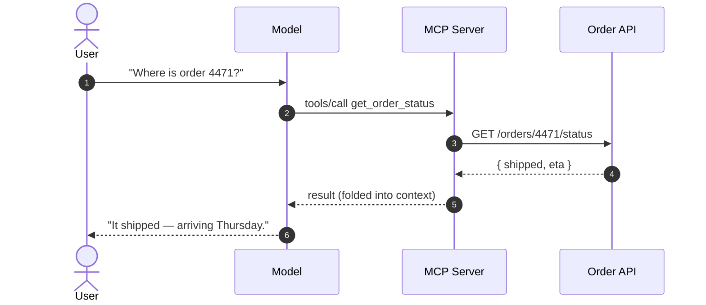

<!-- ============================================================
     PART III — Giving it hands (tools / MCP)
     ============================================================ -->

---
layout: default
---

<Hero bg="part-3.jpg" kicker="Part III · Giving it hands">
  A mind with no hands.
</Hero>

<!--
So we have a brilliant reasoner that sees a window of text and forgets everything between calls.
Notice what it still can't do: anything. It can't read your database, check an order, send an email.
It only emits text. To be useful, it needs hands.
-->

---
layout: default
---

<!-- TOOLS — build-up on fixed stage -->

  

    
The idea behind tools

    <h2>Let the model ask — your code does the work</h2>
  

  

    

      
1 · Model asks

      
"call get_order_status(4471)"

    

    
→

    

      
2 · Your code runs

      
hits the real Order API

    

    
→

    

      
3 · Result goes back

      
folded into the next payload

    

  

  

    The model never touches your systems. It only <strong>requests</strong>; you stay in control of execution.
  

<!--
The mechanism is simple and it puts you in control.
[click] You hand the model a menu of tools it's allowed to ask for.
[click] It doesn't run anything — it emits a request: "please call get_order_status with 4471".
[click] YOUR code receives that, calls the real API — with your auth, your governance.
[click] The result is fed back into the model's next payload, and now it can answer.
[click] Key point for this audience: the model never touches your systems directly. It requests;
you execute. That's a security and governance story, not just a feature.
-->

---
layout: default
clicks: 3
---

<!-- MCP ENVELOPE -->

  

    
What MCP actually is

    <h2>An API with a standard envelope</h2>
  

  <McpEnvelope />
  

    MCP just standardises how a model discovers and calls tools — so any model talks to any tool,
    without a custom integration each time.
  

<!--
MCP — Model Context Protocol — sounds like a new world. It isn't.
On the left, an HTTP call you've shipped a thousand times. On the right, the same intent as an
MCP tool call.
[click] Look at the MCP side: a method, a tool name, JSON arguments, a JSON result.
[click] They line up one-to-one. Endpoint ≈ tool name. Body ≈ arguments. Header ≈ transport.
JSON response ≈ JSON result.
[click] All MCP adds is a standard envelope for discovery and calling — so any model can talk to any
tool without a bespoke integration each time. It's not that different from an HTTP API with a few
agreed constraints. You already know this.
-->

---
layout: default
---

<!-- MCP SEQUENCE — Mermaid (static diagram, no build-up needed) -->

  

    
MCP in motion

    <h2>It reads like any integration flow</h2>
  

<!--
End to end. User asks. The model decides it needs a tool and emits an MCP call. The MCP server
translates that into a real call against your Order API. The result comes back, gets folded into the
context — remember, into the payload — and the model phrases the human answer.
Squint and this is a System API behind a Process API. The model is just one more consumer in the flow.
-->
